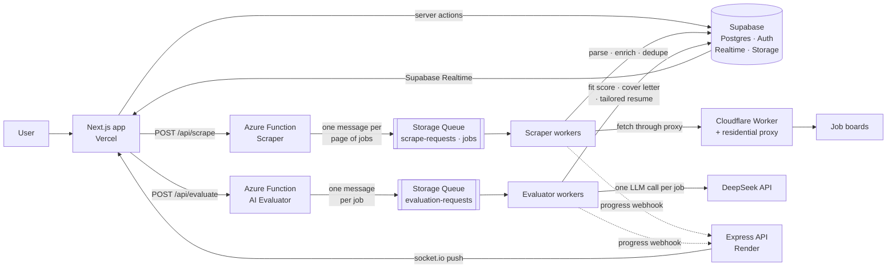
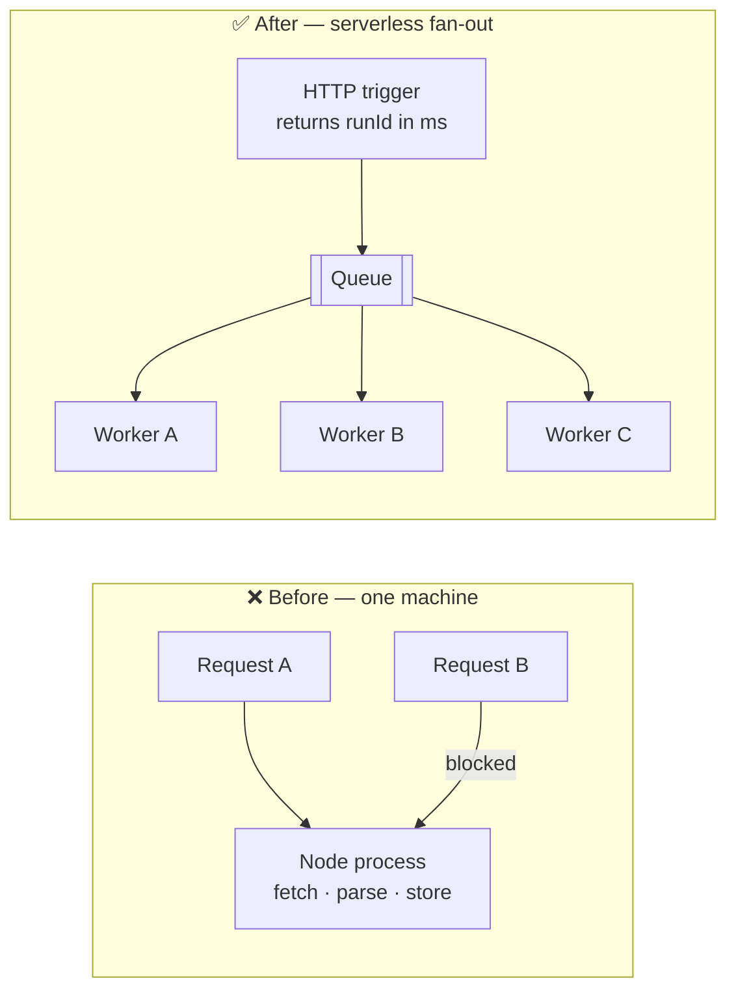

# JobSeek — AI-Powered Job Search Engine

<p align="center">
  <a href="https://www.youtube.com/watch?v=NvKCRjTVL2Q">
    
    <br>
    <strong>▶ Watch the full demo</strong>
  </a>
</p>

<p align="center">
  <a href="https://automated-jobs-application-app.vercel.app"><b>Live app</b></a> ·
  <a href="https://www.youtube.com/watch?v=NvKCRjTVL2Q"><b>Demo video</b></a> ·
  <a href="https://github.com/nickfchmail-ux/node-AI-job-application-engine-rest-api"><b>Backend repo</b></a>
</p>

<p align="center"><em>Smart careers, simplified by AI.</em></p>

---

JobSeek turns an exhausting job hunt into a short, ranked list. Point it at your resume
and a keyword — it scrapes the job boards, uses an LLM to score every listing against your
real experience, and hands back the few jobs worth applying to, each with a tailored resume
and cover letter.

## Contents

- [Why I built this](#why-i-built-this)
- [What it does](#what-it-does)
- [Architecture](#architecture)
- [Tech stack](#tech-stack)
- [The bug that taught me the most](#the-bug-that-taught-me-the-most)
- [Getting started](#getting-started)
- [Environment variables](#environment-variables)
- [How a search flows](#how-a-search-flows)
- [What I learned](#what-i-learned)
- [Roadmap](#roadmap)
- [Known limitations](#known-limitations)

## Why I built this

I'm a **self-taught developer**, and job hunting is brutal — especially without a CS
degree. The worst part wasn't the applications, it was the **noise**: every board has its
own listings, every listing its own wording, and reading them one by one (only to discover
you're not a fit) burned hours I could have spent applying or learning.

So I built the tool I wished existed. Instead of me reading 200 posts, **the AI reads them
and tells me which 10 are worth my time.**

This is my second real project. The first was a
[Pokémon e-commerce app](https://github.com/nickfchmail-ux/next-supabase-pokemon-ecom-demo),
where I learned React fundamentals — state, effects, API calls — and how to lean on
libraries instead of hand-rolling everything. JobSeek is where I moved from *building a UI*
to *designing a system*: a database with row-level security, authentication, background
workers, realtime updates, and a separate serverless AI service.

## What it does

| Feature | What it means |
| --- | --- |
| 🔍 **Multi-board search** | Scrape JobsDB, CTgoodjobs, OfferToday and LinkedIn from one place — no tab-hopping. |
| 🧠 **AI fit scoring** | Every listing is scored 0–100 against *your* resume, with plain-English reasons for the verdict. |
| 📊 **Realtime progress** | The funnel updates live as jobs are found and scored. No refresh, no "is it working?". |
| 🗂️ **Automatic triage** | Listings land in **To Review / Matches / Not Fit / Not Interested**, so a verdict is always one click away. |
| ✍️ **Tailored documents** | Strong fits get a generated cover letter **and** a tailored resume, downloadable as DOCX or PDF. |
| 📈 **Insights dashboard** | Match rate, score distribution, salary intelligence, top strengths and recurring skill gaps. |
| 👤 **Resume management** | Upload a PDF/DOC/DOCX once; every score and document is derived from it. |
| 💳 **Usage-based plans** | Free tier plus paid plans through Stripe, with entitlements enforced server-side. |

Every status is translated into plain human copy — no HTTP codes, queue names or technical
jargon ever reach the UI.

## Architecture

JobSeek is deliberately split into **three deployables**, so a slow job board or a slow LLM
can never block the rest of the app:



- The **Next.js app** owns the UI, the auth session and the server actions. It never talks
  to the job boards or the LLM directly.
- The **scraper Function App** lives in the
  [backend repo](https://github.com/nickfchmail-ux/node-AI-job-application-engine-rest-api)
  and fetches + parses the listings.
- The **AI evaluator Function App** (`azure/ai-evaluator`) scores jobs and writes documents.

## Tech stack

| Layer | Choices |
| --- | --- |
| Frontend | Next.js 16 (App Router, server components), React 19, TypeScript |
| Styling & motion | Tailwind CSS v4, `motion` (Framer Motion), Material UI icons |
| State | Redux Toolkit (live run + job stream), React Query, React server actions |
| Backend-as-a-service | Supabase — Postgres, Auth, Realtime, Storage, row-level security |
| Serverless | Azure Functions + Azure Storage Queues (AI evaluator microservice) |
| AI | DeepSeek — one completion per job, plus one per generated document |
| Realtime | socket.io-client (funnel) + Supabase Realtime (row changes) |
| Documents | `docx` for client-side DOCX generation; print-to-PDF for resumes |
| Payments | Stripe Checkout, Billing Portal and webhooks |
| Hosting | Vercel (app), Render (Express API), Azure Functions (serverless) |

## The bug that taught me the most

My first version did everything in one long-lived Node process. It worked perfectly — for
exactly one user. The moment a second request arrived, the first search was still holding
the event loop, and the **whole server froze**.



I could have "fixed" it with a bigger box or a thread pool. Instead I learned **Azure
Functions** and restructured the work as a queue-driven pipeline:

1. The HTTP trigger does one thing — validate and **enqueue** — then returns immediately.
2. Each queue message handles **one unit of work** (one page of listings, one job to score).
3. Workers **scale out automatically** and retry failures on their own.

That single design change is why the app can serve many users at once, why one flaky job
board can't take the whole system down, and why a 20-second LLM call doesn't stall anything
else.

## Getting Started

1. **Install dependencies**

   ```bash
   npm install
   ```

2. **Set environment variables** — create a `.env.local` file (see the table below).

3. **Run the dev server**

   ```bash
   npm run dev
   ```

   Open [http://localhost:3000](http://localhost:3000).

## Environment variables

| Variable | Visibility | What it's for |
| --- | --- | --- |
| `NEXT_PUBLIC_SUPABASE_URL` | public | Supabase project URL |
| `NEXT_PUBLIC_SUPABASE_ANON_KEY` | public | Realtime + user-scoped Storage access |
| `NEXT_PUBLIC_API_SERVER` | public | Express API server (auth, `/stats/*`) |
| `NEXT_PUBLIC_WS_URL` | public | socket.io URL for the live funnel |
| `NEXT_PUBLIC_AZURE_FN_URL` | public | Scraper Function App base URL (proxied server-side) |
| `NEXT_PUBLIC_EVALUATOR_URL` | public | AI evaluator Function App base URL (proxied server-side) |
| `SUPABASE_SERVICE_KEY` | **secret** | Server-side Supabase key (bypasses RLS) |
| `AZURE_SCRAPE_KEY` | **secret** | Scraper function key |
| `AZURE_EVALUATOR_KEY` | **secret** | Evaluator function key |

```env
# Public — safe in the browser bundle
NEXT_PUBLIC_SUPABASE_URL=https://<project>.supabase.co
NEXT_PUBLIC_SUPABASE_ANON_KEY=<anon_key>
NEXT_PUBLIC_API_SERVER=http://localhost:8080
NEXT_PUBLIC_WS_URL=ws://localhost:8080
NEXT_PUBLIC_AZURE_FN_URL=https://<scraper-app>.azurewebsites.net
NEXT_PUBLIC_EVALUATOR_URL=https://<evaluator-app>.azurewebsites.net

# Secret — server-side ONLY (server actions / proxy routes)
SUPABASE_SERVICE_KEY=<service_role_key>
AZURE_SCRAPE_KEY=<scraper_function_key>
AZURE_EVALUATOR_KEY=<evaluator_function_key>
```

> ⚠️ **Never** put `SUPABASE_SERVICE_KEY`, `DEEP_SEEK_API` or any Azure function key in
> browser-exposed code. They are read only inside server actions and API routes.

## How a search flows

```
1. Sign in         → Supabase Auth → session cookie
2. Find jobs       → POST /api/scrape (Azure Function) → { runId }
3. Watch it live   → socket.io `stats` events drive the funnel;
                     Supabase Realtime streams row updates
4. Review          → /review holds listings that have not been scored yet
5. Score them      → POST /api/evaluate → the evaluator enqueues one message per
                     job, and each job gets its own LLM call for fit + reasons
6. Get documents   → fit jobs trigger a tailored resume (HTML) and a cover letter (DOCX)
7. Apply           → /matches filters by verdict; /overview shows the analytics
```

## The AI evaluator microservice

Evaluation lives in its own deployable unit so a slow or over-budget LLM never blocks
scraping and can scale on its own:

```
azure/ai-evaluator/
├── src/
│   ├── functions/      # evaluate (HTTP → enqueue), workers (queue triggers), evaluateStatus (HTTP)
│   ├── lib/            # orchestrator, ai, prompts, resume, documents, socket, queues, supabase
│   └── shared/types.ts
├── migrations/         # Supabase SQL (evaluation_runs + status columns)
├── host.json / local.settings.json / package.json / tsconfig.json
└── README.md           # local dev + deploy notes
```

`POST /api/evaluate` enqueues one message per job to the evaluator's **own** queue and
returns `202`; a queue-triggered worker scores each job in-process. Jobs are grouped by
`search_key` (the keyword), and each group becomes one `evaluation_runs` row so the UI can
show per-keyword progress. Every job is scored with its own LLM call; jobs that pass the fit
threshold additionally get a tailored resume and a cover letter. State streams live to the
socket and through Supabase Realtime.

## What I learned

- **Serverless isn't just "no servers" — it's a way to think.** Turning long work into
  queued messages changed how I design every feature since.
- **Idempotency and retries are design decisions, not details.** With queue workers,
  "this might run twice" becomes the default assumption.
- **Realtime is a UX feature with a cost.** I moved from unfiltered subscriptions to
  server-side filtered channels and short-lived caches, and the app got *faster* as the
  data grew.
- **Boundary discipline pays off.** Keeping the scraper, the evaluator and the UI as
  separate deployables meant I could change one without breaking the others.
- **Honest error copy matters.** Users don't need `ConnectTimeoutError`; they need
  "we couldn't reach the job boards right now".

## Roadmap

- [ ] **Pre-filter before the LLM** — drop obviously irrelevant listings before paying for a
      completion.
- [ ] **Batch scoring** — score several jobs per request to cut latency and cost.
- [ ] **Application tracking** — go beyond "interested" into a real applied / interview /
      offer pipeline.
- [ ] **Queue-contract tests in CI** — the part of the system that is hardest to verify by
      hand.
- [ ] **Observability** — thread a single run ID through every service and log line.

## Known limitations

- Scraping depends on a residential proxy; a board redesign or a proxy block can break a
  parser or slow a run down.
- The evaluator makes one LLM call per job, so cost scales with search size and plans cap
  usage.
- If the WebSocket can't connect, the dashboard falls back to polling — correct, just less
  instant.

---

Built by [@nickfchmail-ux](https://github.com/nickfchmail-ux) — a self-taught developer
turning a personal job-hunt problem into a portfolio-grade system.
